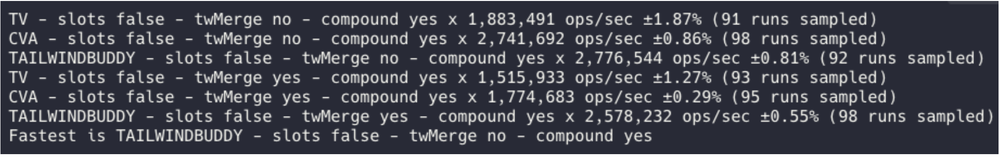
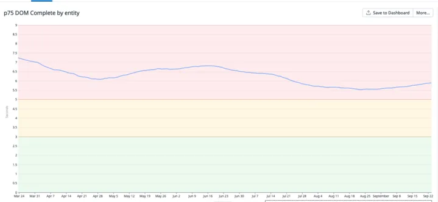

---
# You can also start simply with 'default'
theme: "default"
# random image from a curated Unsplash collection by Anthony
# like them? see https://unsplash.com/collections/94734566/slidev
background: https://cover.sli.dev
# some information about your slides (markdown enabled)
title: Build your next component library with tailwind-buddy
# apply unocss classes to the current slide
class: text-center
# https://sli.dev/features/drawing
drawings:
  persist: false
# slide transition: https://sli.dev/guide/animations.html#slide-transitions
transition: slide-left
# enable MDC Syntax: https://sli.dev/features/mdc
mdc: true
# take snapshot for each slide in the overview
overviewSnapshots: true
---

# Build your next component library with tailwind-buddy

<div class="pt-12">
  <span @click="$slidev.nav.next" class="px-2 py-1 rounded cursor-pointer" hover="bg-white bg-opacity-10">
    By Florent Giraud <carbon:arrow-right class="inline"/>
  </span>
</div>

<div class="abs-br m-6 flex gap-2">
  <a href="https://github.com/busbud/tailwind-buddy" target="_blank" alt="GitHub" title="florent giraud GitHub"
    class="text-xl slidev-icon-btn opacity-50 !border-none !hover:text-white">
    <carbon-logo-github />
  </a>
</div>

---

# About me

Hey I am Florent. Working at busbud for a year and half.

- <carbon-logo-github /> **https://github.com/flozero**
  <br>
- <carbon-logo-linkedin/> **https://www.linkedin.com/in/fgiraud42/**

<style>
h1 {
  background-color: #2B90B6;
  background-image: linear-gradient(45deg, #4EC5D4 10%, #146b8c 20%);
  background-size: 100%;
  -webkit-background-clip: text;
  -moz-background-clip: text;
  -webkit-text-fill-color: transparent;
  -moz-text-fill-color: transparent;
}
</style>

<!--
and I am going to present you why you may want to use tailwind buddy to build your next react component library.
-->

---

# Context

## What is Busbud

- We serve millions of users
- We operate in over 80 countries
- We have more than 10 million landing pages

## What was our main issue

- We faced performance issues across the app, and our old design system wasn’t a good fit for building white-label products.

---

# We decided to create a new design system (Horizon)

We wanted:

- Something that would offer speed—what’s better than CSS and utility classes?
- Something very developer-friendly (DevX)
- Framework agnostic
- 1:1 Figma parity as much as possible
- SSR-friendly, meaning components should support an API to define props across responsiveness (e.g., size or width), so there’s no flicker when transitioning from server to client rendering.

<br>
<br>

<div v-click>
After many iterations, we decided to use TailwindCSS as the best fit for our needs. Now, should we use existing tools to build the component library 
</div>

---

# Why we choose to build tailwind buddy ?

We encountered issues with other libraries like CVA or tailwind-variants:

- They didn’t handle responsiveness well, or at all.
  - Fun fact: Tailwind-variants is used by NEXT UI, but they aren’t even using the latest version, which supposedly supports responsiveness.
- They don’t support random prop values for compound variants. We’ll dive into what that means later.

<br>
<br>
<div v-click>
That’s why we decided to build our own internal tool.
</div>

---

# Simple Example

```ts
import { compose } from "../../utils/tailwind-buddy";

export const ButtonVariants = compose({
  slots: {
    root: /** @tw */ "rounded-3xl",
    label: /** @tw */ "uppercase font-extrabold",
  },
  variants: {
    variant: {
      primary: {
        root: /** @tw */ "bg-surface-primary-cta",
        label: /** @tw */ "text-surface-primary-text",
      },
    },
    size: {
      small: "w-auto px-2 py-1",
    },
  },
  defaultVariants: {
    variant: "primary",
    size: "small",
  },
  responsiveVariants: ["size"],
})<ButtonBaseProps>();

export type ButtonProps = VariantsProps<typeof ButtonVariants>;
```

---

# A bit more complex usage

<!-- show horizon vscode -->

---

# Is it more performant than other tools?



---

# Performance improvments 1/2 ?

## TTFB


---

# Performance improvments 1/2 ?

## DOM complete



---

# What else ?

- With React Native + Expo’s new architecture, which better supports native iOS/Android + web, and thanks to NativeWind…

We can now build for iOS, Android, and web from a single codebase!

<!-- show the app running -->

---

# Thank you

Me:

- <carbon-logo-github /> **https://github.com/flozero**
  <br>
- <carbon-logo-linkedin/> **https://www.linkedin.com/in/fgiraud42/**

Links:

- <carbon-logo-github /> **https://github.com/flozero/tailwind-buddy-presentation-react-native**
- <carbon-logo-github /> **https://busbud.github.io/tailwind-buddy/**
