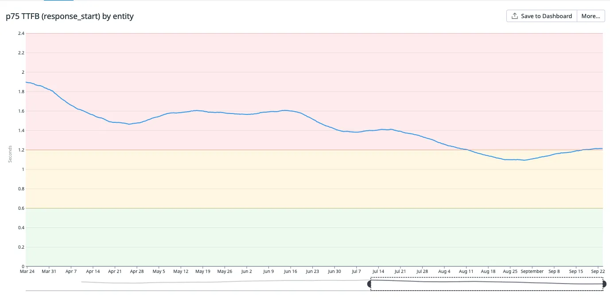

---
# You can also start simply with 'default'
theme: "default"
# random image from a curated Unsplash collection by Anthony
# like them? see https://unsplash.com/collections/94734566/slidev
background: https://cover.sli.dev
# some information about your slides (markdown enabled)
title: Build your next component library with tailwind-buddy
# apply unocss classes to the current slide
class: text-center
# https://sli.dev/features/drawing
drawings:
  persist: false
# slide transition: https://sli.dev/guide/animations.html#slide-transitions
transition: slide-left
# enable MDC Syntax: https://sli.dev/features/mdc
mdc: true
# take snapshot for each slide in the overview
overviewSnapshots: true
---

# Build your next component library with tailwind-buddy

  
    By Florent Giraud <carbon:arrow-right class="inline"/>
  

  <a href="https://github.com/busbud/tailwind-buddy" target="_blank" alt="GitHub" title="florent giraud GitHub"
    class="text-xl slidev-icon-btn opacity-50 !border-none !hover:text-white">
    <carbon-logo-github />
  </a>

---

# About me

Hey I am Florent. Working at busbud a year and half and I am going to present you why you may want to use tailwind buddy to build your next react component library.

- <carbon-logo-github /> **https://github.com/flozero**
   
- <carbon-logo-linkedin/> **https://www.linkedin.com/in/fgiraud42/**

---

# Context

## What is Busbud

- We serve millions of users
- We are in multiple countries 80+
- We have more than 10m+ landing pages

## What was our main issue

- We had issues in terms of performance across the app. And the old design system was not a good fit for building whitelabels

---

# We decided to create a new design system (Horizon)

We wanted:
- Something that would provide us speed. and what better than css and classes ?
- Somehing super Devx friendly 
- Something with 1 to 1 figma parity as much as possible
- SSR friendly. That mean the components should support an api to define component props accross responsivness. Like size width for example so when the componnet are rendered from server to frontend there is no flickering effect visually of the page.

 
 

After many iteration we have decided to use tailwind as the best fit for our problems. So now do we use an existing tools to build the component library

---

# Why we choose to build tailwind buddy ?

We found problems with other libraries like CVA or tailwind-variants:
- None are handling responsivness or not properly
  - fun fact tailwind-variants is used by NEXT UI but they are not even using the latest version that is suppose to support responsivness
- They don’t support random props value for compound variants. We will see later what it is

 
 

So that's why we have decided to build our own internal tools

---

# Example usage

---

# A bit more complex usage

---

# Performance improvments 1/2 ?

## TTFB

---

# Performance improvments 1/2 ?

## DOM complete

---

# What else ?

---

# Thank you